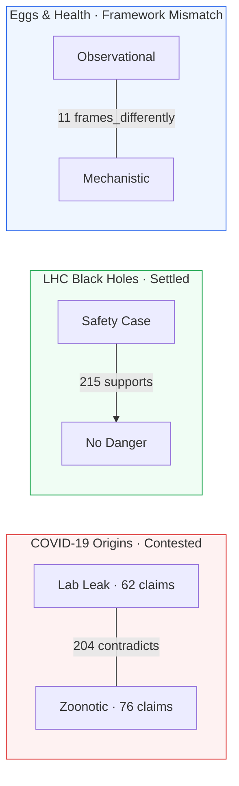
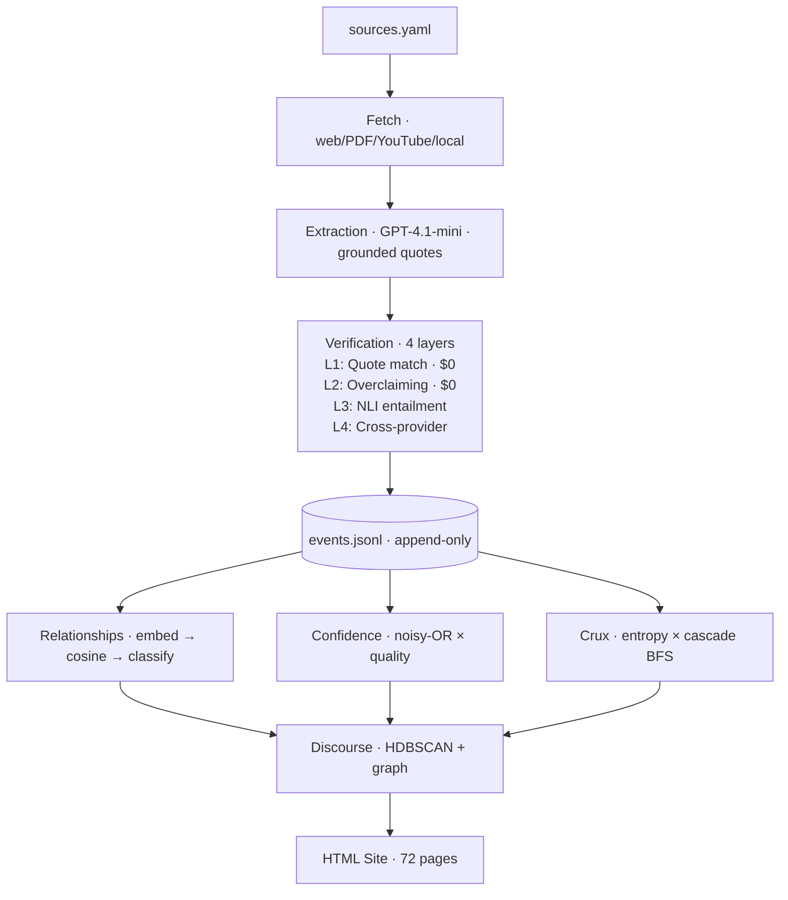

# Epistack-Adversarial

**Structural illumination of epistemic disagreement — not summaries, not verdicts, but navigable maps of WHERE and WHY people disagree.**

<p align="center"><strong>3 cases · 343 claims · 1,693 edges · 72 HTML pages · $1 total · 37 minutes</strong></p>

Takes existing debate materials (papers, transcripts, blog posts) → produces static HTML discourse maps showing positions, cruxes, empty chairs, and performed settling.

Submitted to the [FLF Epistemic Case Study Competition](https://flf.org/epistack-competition), July 2026.

---

## What It Found

Applied to the Rootclaim COVID origins debate ($100K bet, 5 sources, 15 minutes):

1. **The debate performed settling.** All 9 verdict claims declared winners while 46 dependency claims remain contested (confidence 0.3–0.7). The $100K bet format structurally prohibits "I don't know" — both debaters' expressed confidence is inflated regardless of argument quality (arXiv:2605.02398).
2. **The 23-OOM Bayesian divergence traces to a single prior.** Weissman assigns P(lab leak) ≈ 1/200. Rootclaim assigns ~50% for Wuhan-origin pandemics. That 100× gap before any evidence is weighed accounts for most of the spread.
3. **The top crux is empirical and traceable.** WIV conducting gain-of-function in BSL-2 conditions (crux score 0.61) is the claim whose resolution would most cascade through the debate graph.
4. **Five perspectives are structurally absent.** Virological genomics, contact tracing, and lab safety whistleblowers — identified adversarially, not by assumption.

---

## Three Cases, Three Different Diagnoses



| Case | Diagnosis | Key Evidence |
|------|-----------|--------------|
| **COVID** | Contested — cruxes unresolved, settling detected | 204 contradicts, 9 verdicts settling, 10 live cruxes |
| **LHC** | Settled — system correctly identifies consensus | 215/232 edges are `supports`, no contested cruxes |
| **Eggs** | Framework mismatch — not a factual dispute | 11 `frames_differently` edges, no load-bearing crux |

---

## Proof

| Case | Sources | Claims | Edges | Cost | Time | Pages |
|------|---------|--------|-------|------|------|-------|
| COVID-19 Origins | 5 | 230 | 1,242 | $0.30 | 15 min | 29 |
| LHC Black Holes | 4 | 53 | 232 | $0.20 | 10 min | 21 |
| Eggs & Health | 5 | 60 | 219 | $0.25 | 12 min | 22 |
| **Total** | **14** | **343** | **1,693** | **~$1** | **~37 min** | **72** |

More sources = denser graph = more precise crux detection. Cost per case enables unlimited iteration.

---

## Get Started (60 seconds)

```bash
# 1 — Clone + verify (no API key needed)
git clone https://github.com/rkstu/epistack-adversarial
cd epistack-adversarial
uv sync --extra dev
uv run python scripts/verify.py   # 103 tests + output validation → exit 0

# 2 — View pre-built output (no API key needed)
open output/covid_origins/index.html

# 3 — Reproduce (requires API key, ~$0.30)
echo 'OPENROUTER_API_KEY=your-key-here' > .env
uv run python run_pipeline.py covid_origins --phase full --budget 1.0
```

To change models or providers: edit `config.yaml`. One line switches from OpenRouter to Anthropic to OpenAI — zero code changes.

---

## How It Works



15 Python modules · 4,000+ lines · 103 tests · provider-agnostic

**Key innovations:**
- **Compliance-trap detection** (arXiv:2605.02398) — Detects G3 pressure before every LLM call, applies M2/M3 defenses (+18.5pp, +19.3pp recovery)
- **`frames_differently` edge type** — Distinguishes "asking different questions" from "disagreeing on facts"
- **Performed settling detection** — Detects when debates declared winners without resolving underlying cruxes
- **Correlated evidence detection** — Prevents N citations of one paper from inflating confidence as N independent lines

---

## Add a Challenge (Collaboration Demo)

```bash
uv run python scripts/add_challenge.py covid_origins \
    --target clm_0037 \
    --body "NIH P3CO board classified WIV research as not gain-of-function" \
    --source-url "https://www.nih.gov/p3co" \
    --source-label "NIH P3CO Review Board"

# Re-run to see cascade
uv run python run_pipeline.py covid_origins --phase full --budget 1.0
```

New evidence enters the append-only store → cascades through all downstream confidence and crux scores → discourse map updates — without modifying existing claims.

---

## Inspect Raw Pipeline Output

[`data/sample/pipeline_trace.json`](data/sample/) — committed trace showing the full lifecycle of one claim (clm_0037, top crux) through all pipeline stages:

1. **Claim extracted** — with mandatory source quote (`quote_verified: true`)
2. **29 edges detected** — supports, contradicts, qualifies, frames_differently
3. **Confidence computed** — noisy-OR × quality product
4. **Settling flagged** — verdict depends on this unresolved claim
5. **Position assigned** — via HDBSCAN + graph community
6. **Challenge added** — counter-evidence cascades through the graph

---

## Documentation

| Document | Contents | Read When |
|----------|----------|-----------|
| **This README** | Findings, proof, how to run and verify | Start here |
| **[docs/SUBMISSION.md](docs/SUBMISSION.md)** | Formal entry — findings → trust → architecture → scaling → unknowns | Full picture |
| **[docs/METHODOLOGY.md](docs/METHODOLOGY.md)** | Epistemic approach: crux formula, settling, framework mismatches. No code. | Why this approach |
| **[docs/PIPELINE.md](docs/PIPELINE.md)** | Every module, config reference, design decisions with rationale, how to extend | How it works |
| **[docs/diagrams/](docs/diagrams/)** | Architecture, COVID discourse structure, three-case comparison (Mermaid) | Visual understanding |
| **[DEVELOPMENT.md](DEVELOPMENT.md)** | Full build chronology, parameter tuning, debugging history (14→1,242 edges) | Continue development |
| **[config.yaml](config.yaml)** | All runtime parameters with WHY comments | Tune or switch providers |

Every folder has a `README.md` explaining its purpose.

---

## Folder Structure

```
epistack-adversarial/
├── README.md                  # This file — start here
├── run_pipeline.py            # One command → full HTML site
├── config.yaml                # All parameters with WHY comments
├── pyproject.toml             # Dependencies (uv)
├── src/epistack/              # 15-module Python library
├── examples/                  # Source registries (sources.yaml per case)
├── output/                    # Pre-built HTML (no API key to view)
├── data/sample/               # Committed pipeline trace
├── tests/                     # 103 tests (no API keys)
├── scripts/                   # verify.py · smoke_test.py · add_challenge.py
├── docs/                      # SUBMISSION · METHODOLOGY · PIPELINE
│   └── diagrams/             # Mermaid diagrams (rendered by GitHub)
├── static/                    # Shared CSS
└── archive/                   # v0 prototype (reference only)
```

---

**Author**: Rahul Kumar | **Paper**: [arXiv:2605.02398](https://arxiv.org/abs/2605.02398) | **Competition**: [FLF Epistemic Case Study](https://flf.org/epistack-competition)
