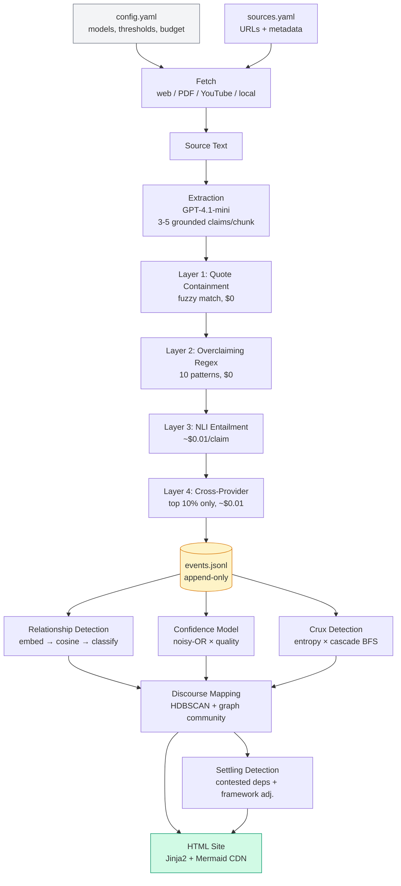

# Architecture Diagram

```mermaid
flowchart TD
    CONFIG[config.yaml<br/>models, thresholds, budget]
    SOURCES[sources.yaml<br/>URLs + metadata]

    CONFIG --> FETCH
    SOURCES --> FETCH

    FETCH[Fetch<br/>web / PDF / YouTube / local] --> TEXT[Source Text]
    TEXT --> EXTRACT[Extraction<br/>GPT-4.1-mini<br/>3-5 grounded claims/chunk]

    EXTRACT --> L1[Layer 1: Quote Containment<br/>fuzzy match, $0]
    L1 --> L2[Layer 2: Overclaiming Regex<br/>10 patterns, $0]
    L2 --> L3[Layer 3: NLI Entailment<br/>~$0.01/claim]
    L3 --> L4[Layer 4: Cross-Provider<br/>top 10% only, ~$0.01]

    L4 --> STORE[(events.jsonl<br/>append-only)]

    STORE --> REL[Relationship Detection<br/>embed → cosine → classify]
    STORE --> CONF[Confidence Model<br/>noisy-OR × quality]
    STORE --> CRUX[Crux Detection<br/>entropy × cascade BFS]

    REL --> DISC[Discourse Mapping<br/>HDBSCAN + graph community]
    CONF --> DISC
    CRUX --> DISC

    DISC --> SETTLE[Settling Detection<br/>contested deps + framework adj.]
    DISC --> SITE[HTML Site<br/>Jinja2 + Mermaid CDN]
    SETTLE --> SITE

    style CONFIG fill:#f3f4f6,stroke:#6b7280
    style STORE fill:#fef3c7,stroke:#d97706
    style SITE fill:#d1fae5,stroke:#059669
```
