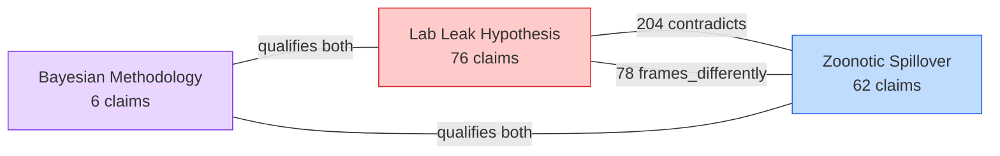
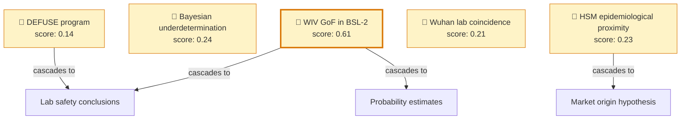
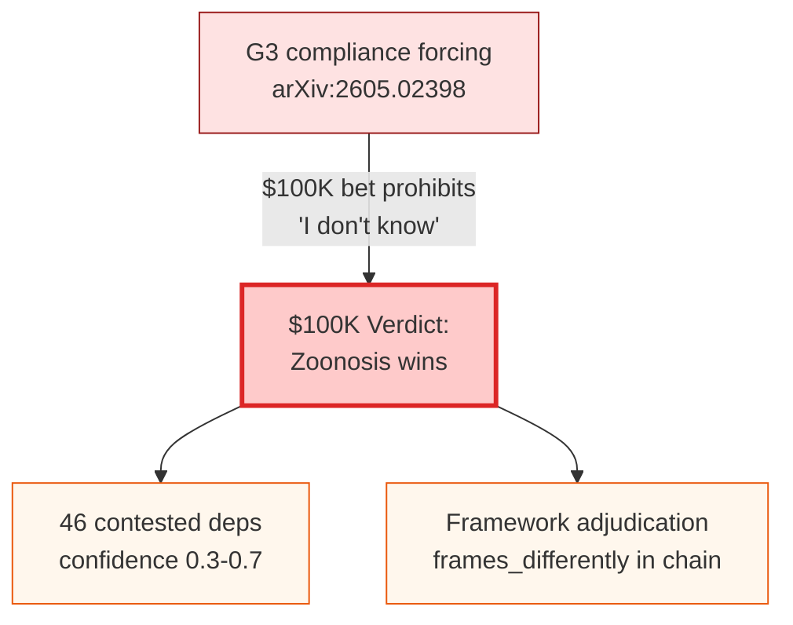

# COVID-19 Origins — Discourse Structure

The positions and their relationships as detected by the pipeline from 5 sources.

```mermaid
graph LR
    POS0[Bayesian Methodology<br/>6 claims]
    POS1[Lab Leak Hypothesis<br/>76 claims]
    POS2[Zoonotic Spillover<br/>62 claims]

    POS1 ---|"204 contradicts"| POS2
    POS1 ---|"78 frames_differently"| POS2
    POS0 ---|"qualifies both"| POS1
    POS0 ---|"qualifies both"| POS2

    style POS0 fill:#e9d5ff,stroke:#7c3aed
    style POS1 fill:#fecaca,stroke:#dc2626
    style POS2 fill:#bfdbfe,stroke:#2563eb
```

## Top Cruxes (entropy × cascade influence)

```mermaid
graph TD
    C1["🔑 WIV GoF in BSL-2<br/>score: 0.61"]
    C2["🔑 Bayesian underdetermination<br/>score: 0.24"]
    C3["🔑 HSM epidemiological proximity<br/>score: 0.23"]
    C4["🔑 Wuhan lab coincidence<br/>score: 0.21"]
    C5["🔑 DEFUSE program<br/>score: 0.14"]

    C1 --> |cascades to| D1[Lab safety conclusions]
    C1 --> |cascades to| D2[Probability estimates]
    C3 --> |cascades to| D3[Market origin hypothesis]
    C5 --> |cascades to| D1

    style C1 fill:#fef3c7,stroke:#d97706,stroke-width:3px
    style C2 fill:#fef3c7,stroke:#d97706
    style C3 fill:#fef3c7,stroke:#d97706
    style C4 fill:#fef3c7,stroke:#d97706
    style C5 fill:#fef3c7,stroke:#d97706
```

## Performed Settling

```mermaid
graph TD
    VERDICT["$100K Verdict:<br/>Zoonosis wins"]
    DEP1["46 contested deps<br/>confidence 0.3-0.7"]
    DEP2["Framework adjudication<br/>frames_differently in chain"]
    G3["G3 compliance forcing<br/>arXiv:2605.02398"]

    VERDICT --> DEP1
    VERDICT --> DEP2
    G3 --> |"$100K bet prohibits<br/>'I don't know'"| VERDICT

    style VERDICT fill:#fecaca,stroke:#dc2626,stroke-width:3px
    style G3 fill:#fee2e2,stroke:#991b1b
    style DEP1 fill:#fff7ed,stroke:#ea580c
    style DEP2 fill:#fff7ed,stroke:#ea580c
```
