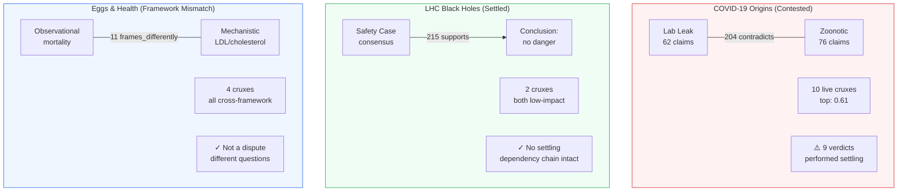

# Three Cases — Different Epistemic Structures

Same pipeline, three different diagnoses:

## What Each Case Demonstrates

| Case | Pipeline Diagnosis | Key Evidence |
|------|-------------------|--------------|
| **COVID** | Contested — cruxes unresolved, settling detected | 204 `contradicts`, 78 `frames_differently`, 9 verdicts settling |
| **LHC** | Settled — dependency chain supports conclusion | 215/232 edges are `supports`, minimal contradictions |
| **Eggs** | Framework mismatch — not a factual dispute | 11 `frames_differently` edges, no single load-bearing crux |
